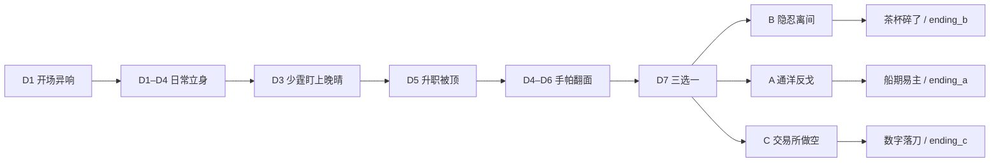

# 故事线梳理 × 演出计划

> 版本：2026-08-08 · 接在 `IMPROVEMENT_PLAN.md`（文案/任务/轻过渡已落地）之后  
> 目标：用**轻量演出**把关键剧情从「读一段字」变成「记得住的一刻」  
> 原则：**不造大型过场系统**；优先挂在 `EventPanel` / `DialoguePanel` / `WorldHost` veil / `SfxPlayer` / `EndingScreen`

---

## 1. 故事线总览

**一句话：** 港口装卸组长林阿海，在婚事与升职的「顺风」里发现已被周家父子与未婚妻苏晚晴卷入局中，于第 7 天选定复仇取向前，把裂缝推到爆点。

| 幕 | 日程 | 玩家在干什么 | 故事在说什么 |
|---|---|---|---|
| **序** | 新游戏 → 进档 | 标题序章铺身份 → 开场事件反转 | 你是谁/港城 → 顺风异响 → 「我已被卷进局里了」 |
| **立身** | D1–D2 | 码头搬货 → 公司办公 → 回家安顿 | 身份、地点、日常节拍 |
| **上桌** | D2–D5 | 见晚晴/少霆、摸情报 | 三角关系与权谋入场 |
| **裂痕** | D3–D6 | 被盯上 → 升职被顶 → **手帕** | 外部打压 + 私密背叛 |
| **分岔** | D7 晚 | 选 A / B / C | 确立复仇取向 |
| **推深** | D8+ | B 加深父子裂缝 / A 通洋 / C 牌桌 | 主动出手，不再只是挨打 |
| **爆点** | 路线就绪 | 公开对立 / 截胡 / 做空 | 命运落点（阶段结局） |
| **长线** | ~D12–D28 | 完整日程（可选） | Demo 加深，非展示必打 |

**角色锚点**

| 角色 | 功能 |
|---|---|
| 林阿海（玩家） | 从「过日子」被迫变成「站队」 |
| 苏晚晴 | 信任 → 疏远/可能背叛；家是情绪位 |
| 周少霆 | 情敌 + 副理；笑声/手帕/对立的人面 |
| 周鸿业 | 公司压迫源；茶杯碎裂的拍板者 |
| 陈掌柜（通洋） | A 线对岸刀柄 |
| 交易所 | C 线「刀在账上」的舞台 |

**展示档主推节奏（10–15 分钟）：** 开场反转 → 码头/公司摸人 → 手帕翻面 → D7 选 B → 推裂缝 → 茶杯碎了。

---

## 2. 演出原则（怎么加、加什么）

| 做 | 不做 |
|---|---|
| 关键 beat **分段读 + 停顿 + 音效/色罩** | 完整分镜动画、语音、Timeline 大系统 |
| 复用现有模态：事件 / 对话 / 结局叠层 | 另开引导 tip 弹窗 |
| 每场演出 **1 个记忆点**（一声笑、一块帕、一声碎） | 同一场堆特效 |
| 数据可配（event_id → staging 预设） | 每个事件硬编码一长段脚本 |

**建议最小能力（一次做薄）：**

1. `EventPanel`：正文可按 `|||` 或行号**分段出现**；段间短黑场/色闪  
2. `SfxPlayer`：按事件播 **一次性 stinger**（门缝笑、碎瓷、雨、钟）  
3. `WorldHost` / 全屏 veil：事件期间短暂 **色温偏移**（暖顺 → 冷异）  
4. `DialoguePanel`：关键行后 **立绘微动/变暗**（已有 Portrait，可加强）  
5. `EndingScreen`：进结局前 **1.5s 静场**（标题晚出）

---

## 3. 演出计划表（按优先级）

### P0 — 必须有（先做开头）

| 序 | 阶段 | 钩子 ID | 演出意图（玩家应感到） | 具体做法（轻量） | 验收 |
|---|---|---|---|---|---|
| **S0** | **开场** | `TitleMenu` 序章 + `ev_day1_intro` | 90 秒内：身份铺垫 → 顺 → 异响 → 卷入 | 标题三段序章（潮声）；进档后事件：①路过副理 ②笑声+应声（stinger+冷暗）③茶杯盖；选项延迟+短静场 | 新开档先知「我是谁」，再感到反转 |
| S1 | 手帕翻面 | `ev_day6_su_distance` | 「她把帕子藏进掌心」特写感 | 2 段：见帕绣「霆」→ 藏帕+冷笑/静默；质问/隐忍选项带不同短音 | 玩完能复述「手帕」 |
| S2 | 三选分岔 | `ev_day7_choice` | 三条路有重量，不是三个按钮 | 潮声 ambience 抬高；选项依次淡入，B/A/C 各一色边（复用 choice 样式） | 选完有「立誓」停顿 |
| S3 | B 线爆点 | `ev_b_public_clash` → `ending_b` | 茶杯碎了=记忆点 | 碎瓷 stinger + 短闪白/暗；Ending 标题「裂缝开了」晚 1s 出，正文打字或分段 | 朋友能复述那句命运句 |

### P1 — 展示档加强（开场后立刻跟）

| 序 | 阶段 | 钩子 ID | 演出意图 | 具体做法 | 验收 |
|---|---|---|---|---|---|
| S4 | 升职被顶 | `ev_day5_promotion_stolen` | 公开打压的屈辱 | 进事件前公司 ambience 压低；确认选项后短静场再回漫游 | 「……是，老板」后气闷一下 |
| S5 | 少霆盯上 | `ev_day3_son_notice` | 危机从远处变成现实 | 少霆立绘/色块亮一下；一句旁白停顿 | D3 不再像日常流水账 |
| S6 | 进关键建筑 | `WorldHost` 进 `company` / `home` / `dock` | 地点情绪切换 | 扩展现有 veil：首次进公司略长；手帕夜后回家 veil 偏冷 | 盲测能感到「家变了」 |
| S7 | 晚晴对话变冷 | `dlg_su_talk` + betray 变体 | 关系翻面可「看见」 | 背叛旗标后：立绘暗一档、选项色边变冷、进对话短 bell | 同场景对话 visibly 变味 |

### P2 — 分线高潮与长线点缀

| 序 | 阶段 | 钩子 ID | 演出意图 | 具体做法 | 优先级说明 |
|---|---|---|---|---|---|
| S8 | A 高潮 | `ev_a_first_strike` → `ending_a` | 船期易主的利落 | 铃声/纸页音 + Ending 静场（对齐 S3 模板） | 展示若推 A 再抬 |
| S9 | C 高潮 | `ev_c_first_short` → `ending_c` | 数字落刀 | 牌价 tick 音 + 数字感短闪 | 同上 |
| S10 | B 雨夜/隔墙 | `ev_b_d22_rain` / `ev_b_d24_boardroom_noise` | 长线氛围记忆 | 雨循环 / 闷响一声即可 | 完整 Demo 加厚 |
| S11 | 失败结局 | `ev_fail_fired` / `ev_fail_broke` | 坠落感 | Ending 偏红暗 veil，无胜利 stinger | 防「失败也像通关喜报」 |
| S12 | 节日/风暴 | `ev_d16_festival` / `ev_d20_storm` | 世界在动 | 环境音切换 + 一段式正文即可 | 低成本点缀 |

---

## 4. 推荐实施顺序（日程）

| 日 | 做 | 产出 |
|---|---|---|
| **D1** | **S0 开场三段式** + 笑声 stinger + veil | 新开档立刻有「戏」 |
| D2 | S1 手帕 + S7 对话变冷挂钩 | 中段背叛可演 |
| D3 | S2 三选 + S3 茶杯/结局模板 | 展示档头尾闭环有演出 |
| D4 | S4 + S5 + S6 地点情绪 | 中段不再干 |
| D5 | 从头试玩 12 分钟；按 §5 打勾；修节奏 | 可录展示 |

A/C 与长线（S8–S12）放在展示档头尾演出稳定之后。

---

## 5. 验收清单

- [ ] 新开档 **不开任务栏** 也能在 90 秒内感到「事情不对」（S0）
- [ ] 手帕事件后，玩家能主动提到「帕子 / 霆字」（S1）
- [ ] D7 三选有停顿与分量，不像随便点（S2）
- [ ] B 线结局有「碎」的听感或视感，再出命运句（S3）
- [ ] 未改坏：事件选项、存读档、进门、任务栏、中英 l10n
- [ ] 仍无大型 Timeline / 语音依赖

---

## 6. 与现有文档关系

| 文档 | 管什么 |
|---|---|
| `IMPROVEMENT_PLAN.md` | 文案冲击、任务展示档、轻 veil/音效分轨（已完成） |
| **本文 `STAGING_PLAN.md`** | **在关键 beat 上加「演出」**，让代入感从文字进到听感/节奏 |
| Pack CSV + `l10n` | 故事正文权威源；演出只编排呈现，不改故事因果 |

**开场正文锚点（勿改坏因果）：**  
`events.ev_day1_intro` — 顺风 → 少霆笑声/晚晴应声 → 有人已经在替你安排。

---

*下一步若开工：先做 S0（EventPanel 分段 + 一声笑 + 选项延迟），再复用同一套模板到 S1/S3。*
