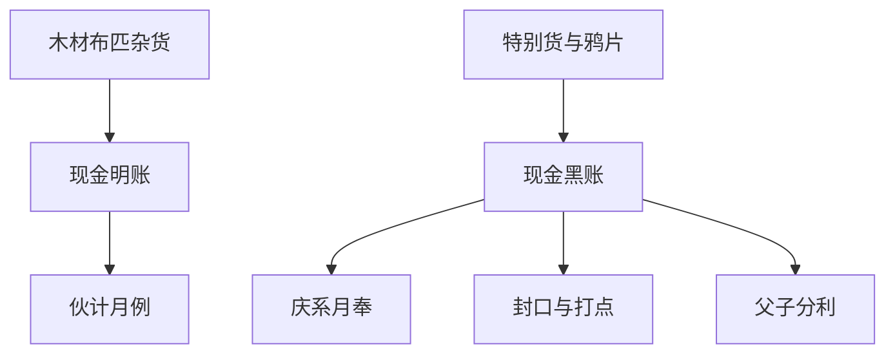

# 钱记商行 · `org_qianji`

## 名片

| 项 | 内容 |
|---|---|
| 明面业务 | 南洋木材、布匹、杂货进出口 |
| 暗线 | 木材掩护鸦片：走关完税（瞒股东）+ 绕关走私（供庆大人） |
| 东家 | `char_qian_demao` |
| 关键场所 | `loc_01` `loc_02` |
| 开局玩家职 | 学徒 |

## 钱路画像

| 项 | 内容 |
|---|---|
| 明账来源 | 木材、布匹、杂货正常贸易；门面、月例、体面全靠这条线养 |
| 灰账来源 | 上下游回扣、压价、牙行抽手、账期挪腾 |
| 黑账来源 | 木材掩护鸦片、截留特别货、庆系月奉链 |
| 主要支出 | 伙计月例、仓储运费、打点、封口、庆系月奉 |
| 最脆弱环节 | 父子分利失衡、账房穿帮、下层嘴不严 |
| 对玩家意义 | 最稳工钱来源；也是黑账真相、账权与 **外场→跑街** 爬升的主战场 |

> 钱记内部职级权威见 [`../13_职级档案/职级阶梯.md`](../13_职级档案/职级阶梯.md)。

## 组织层数值（可选，Demo 可简化）

| 字段 | 初值草案 | 含义 |
|---|---|---|
| `firm_bright` | 55 | 明业成色 |
| `firm_dark` | 40 | 暗账活跃度 |
| `firm_heat` | 25 | 外患/穿帮风险 |
| `cash_bright` | 60 | 明面现金流 |
| `cash_dark` | 45 | 黑账现金流 |
| `liquidity` | 50 | 周转宽紧 |
| `payroll_pressure` | 20 | 工资与伙计养成压力 |
| `tribute_pressure` | 35 | 对庆系月奉与各路打点压力 |
| `support_mid` | 15 | 中层伙计对玩家支持（主角追踪） |
| `support_low` | 20 | 下层伙计对玩家支持 |

父子内斗（`rel_qian_father_son` < 30）→ 运营效率下降、行情波动、东家更依赖玩家。

### 资金流逻辑

### 玩家切入点

- **活路**：`act_01` 的碎银与跑街月例预期
- **账权**：`act_02`、`E013`、`E016`
- **基层政治**：`act_05`、`R008`
- **黑钱真相**：`E010`、`E015`

### A 线收益层级（钱记口径）

| 层 | 对林瑞生的现实意义 | 组织为什么愿意给 |
|---|---|---|
| 月例 | 给你一条稳活路，让你留在体系内 | 好用、听话、能跑腿 |
| 赏钱 | 让你觉得跟着东家有甜头 | 临时活办得利索，值得笼络 |
| 应酬账 | 让你出面替商行撑体面 | 已可被当成门面上的小代表 |
| 账权 | 让你开始碰“先记后报、先压后放”的钱路 | 东家/账房开始拿你当自己人 |
| 暗线账权 | 让你知道哪笔钱不能写明白 | 不是奖赏，是把你绑进体系 |

## 权限门槛（摘要）

| 条件 | 解锁 |
|---|---|
| 商行信任度 ≥ 45 | 外场职位（章二主爽门槛之一） |
| 商行信任度 ≥ 50 | 跑街职位（隐忍线章终要素） |
| 嫌疑 ≥ 50 且信任 ≤ 20 | 降杂役 |
| 嫌疑 ≥ 70 | 开除 · 隐忍线失败 |

## 剧情金融挂点

| 节点 | 金融意义 |
|---|---|
| `E003` | 第一次闻到“账不对” |
| `E013` | 黑账链首次成形 |
| `E014` | 钱子安被排除在大钱路外的情绪爆发 |
| `E015` | 暴利、盗卖、脏钱集中爆开 |
| `E018A` | 从工钱人变成经手账的人 |
