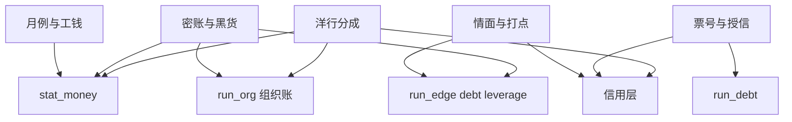

# 金融系统（设计）

> 服务 Demo，也服务世界观。  
> 核心原则：**钱不是单一余额，而是现金、债务、信用、账权、黑钱五层叠加。**  
> 相关：[`主角属性.md`](主角属性.md) · [`阈值与惩罚.md`](阈值与惩罚.md) · [`日tick.md`](日tick.md) · [`../00_总纲/数据库架构.md`](../00_总纲/数据库架构.md)

---

## 1. 设计目标

《暗潮》的金融系统不是做“商战小游戏”，而是要把现有剧情里的：

- **活路**：月例、生活费、聘礼、体面
- **门路**：茶钱、请客、赏钱、票号往来、引荐名片
- **账权**：谁能看账、谁能摸到密账、谁能经手外账
- **黑钱**：回扣、走私、封口费、盗卖、买办抽成
- **权力**：父子分利、东家分账、洋行分成、庆系月奉

写成同一套结构。

一句话：**小钱决定你能不能活，大钱决定你敢不敢坏。**

---

## 2. 五层模型

### 2.1 玩家现金流层

权威字段仍是 `stat_money`。

它表示玩家**此刻能动用的活钱**，不是总身家，也不是黑钱总量。Demo 中它承载：

- 日常生计：生活费、衣食住用
- 体面支出：请客、送礼、聘礼、汇银
- 门槛支出：茶钱、酒钱、打点、跑票号
- 应急周转：借钱、还息、封口

### 2.2 债务层

债务描述“这笔钱不是你的，是你临时借来的活路”。

它至少应回答：

- 你欠谁
- 欠多少
- 利息怎么滚
- 何时到期
- 逾期后谁来逼你

### 2.3 信用层

信用不是钱，但会决定钱流向谁。

《暗潮》里至少有三种信用：

- **票号信用**：你是不是“能周转的人”
- **街市信用**：你是不是“说话算数、肯散钱、值得往来的人”
- **洋行信用**：你是不是“能长期替人省成本、开门路的人”

建议字段：

- `stat_credit_bank`
- `stat_credit_market`
- `stat_credit_foreign`

它们都属于**主角侧可累积信用**，不替代 `meter.impression_*`：

- `meter.impression_bradley` / `meter.impression_qing` 偏“某关键人物对你怎么看”
- `stat_credit_*` 偏“某整条交易网络愿不愿继续和你做生意”

### 2.4 关系金融层

很多账不记在账本上，记在人心里。

关系金融包括：

- 人情债
- 欠一次站台
- 被人捏住把柄
- 拿过谁的封口费
- 替谁担过风险

因此，`run_edge.debt` / `run_edge.leverage` 不只是备注，而是金融系统的一部分。

在如烟线里，还应特别区分一类**情面资产**：

- 礼物本身未必要进 `run_item`
- 但“收了谁的礼”“退了谁的礼”“欠了谁的心意”会改变边上的 `debt / leverage`
- 换句话说，情面资产的本体常常不是物，而是**这件物留下的人情债与压迫感**

### 2.5 组织账务层

钱记、聚丰、宝顺、庆系都不只是“背景组织”，而是不同的钱路机器。

组织层要回答：

- 明钱靠什么流入
- 暗钱靠什么流入
- 钱花在谁身上
- 哪一层最容易断
- 哪一条线一断就要靠人吃亏补

---

## 3. 三条账

为了让玩法和戏剧都清楚，建议把《暗潮》的钱拆成三种“账感”：

### 3.1 明账

能摆上台面的收入与支出。

例：

- 月例
- 差事赏钱
- 票号汇兑
- 商行工资
- 洋行正式佣金

### 3.2 灰账

人人都知道有，但没人愿意写明白。

例：

- 请客后的回话
- 打点后的顺手
- 竞品私下资助
- 票号信用背书
- 介绍费、牙行费

### 3.3 黑账

见不得光，但最能推人跨线。

例：

- 鸦片账外银
- 封口费
- 密账分利
- 盗卖特别货
- 买办抽头

设计原则：

- **明账**解决“活不活得下去”
- **灰账**解决“门开不开”
- **黑账**解决“值不值得赌命”

---

## 4. 资金流总图

---

## 5. 玩家侧五种金融压力

### 5.1 现金压力

钱不够花，玩家被迫缩行动、缩体面、缩关系维护。

主要来源：

- 日末生活费
- 茶钱、酒钱、礼钱
- 票号利息
- 临时封口或打点

### 5.2 时间压力

有的钱不是“借不到”，而是“来不及还”。

适配情境：

- 票号短借
- 聘礼准备
- 某次行动前必须攒够体面钱
- 洋行/竞品要求你先做出结果再谈价

### 5.3 体面压力

钱少不一定饿死，但会先丢脸。

适配情境：

- 空手见如烟
- 请不起师兄
- 票号把你当零碎客
- 街市上没人肯跟你深谈

典型闭环：

- `E002` 抬起“婚事资金压力”
- `E008` 把这压力从空话变成金镯、席面、活路的现实竞争
- `ACT_06` / `ACT_08` 负责日常表现“有情分，但钱不够”
- `ACT_11.remit` 提供第一条正规缓解口
- `R006` 再把玩家从“只能硬扛的人”抬成“能正经周转的人”

### 5.4 风险压力

来钱越快，越可能抬嫌疑、伤路线、留把柄。

适配情境：

- 盗卖特别货
- 封口
- 走私银票
- 利用庆系名头
- 提前吃洋行的甜头

### 5.5 权力压力

真正的大钱不在荷包里，在谁能决定钱怎么流。

适配情境：

- 钱德茂不给钱子安分大钱路
- 林瑞生想从跑腿变成经手账的人
- 赵鸿运评估你值不值得投位子
- 白瑞德评估你能不能做长期代理

---

## 6. 路线差异

### A 隐忍线：从工钱走到账权

核心问题不是“暴富”，而是：

- 能不能先稳住活路
- 能不能熬到拿到账房与应酬账
- 能不能在父子内斗里成为真正经手的人

金融体验：

- 现金低波动
- 体面压力长期存在
- 账权收益后置
- 黑账知道得越多，越危险

关键挂点：

- `act_01` / `act_02`
- `E013` / `E014` / `E016`
- `E018A`

收益结构：

| 阶段 | 典型收益 | 代价 |
|---|---|---|
| 短期 | 工钱、差事赏钱 | 穷、慢、要熬 |
| 中期 | 跑街月例、应酬账 | 更深地卷进钱记体系 |
| 长期 | 账权、内外账经手权 | 知道太多，退路更少 |

建议把 A 线再拆成五层收益感：

1. **月例保活**：先让玩家不再只靠零碎工钱喘气
2. **赏钱弹性**：开始有一点不写进固定工资的活钱
3. **应酬账代付**：玩家可先垫商行体面钱，再走报账
4. **账权经手**：玩家能影响钱先给谁、账先记哪边
5. **暗线入口**：玩家被允许接近“不该写明白的钱”

其中 3-5 层的价值，不一定直接表现成 `stat_money` 大涨，而是表现成：

- 玩家更容易保住体面
- 玩家更容易撬开关系与信息
- 玩家在组织内部越来越“退不出去”

### B 跳槽线：把情报和人脉卖个好价

核心问题不是“有没有银子”，而是：

- 你在市场上值多少钱
- 你能带走多少人脉与情报
- 赵鸿运愿不愿为你开位子、投启动钱

金融体验：

- 前期靠体面与人脉抬估值
- 中期靠市场消息试价
- 后期靠订单与职位兑现价值

关键挂点：

- `act_07` / `act_10`
- `R005`
- `E018B`

收益结构：

| 阶段 | 典型收益 | 代价 |
|---|---|---|
| 短期 | 市场信用、被报价资格 | 还没真正拿钱 |
| 中期 | 启动资金、职位甜头 | 与钱记正式撕裂 |
| 长期 | 订单、客户、市场位子 | 一旦估值跌，收益也会塌 |

### C 洋人线：先做价码，再谈分成

核心问题不是“你有多少钱”，而是：

- 你有没有别人没有的门路
- 你的手书、把柄、情报值不值长期下注
- 洋行愿不愿让你从跑腿人变成代理人

金融体验：

- 前期靠门路，不靠现金
- 中期靠手书、风声、关系作价
- 后期才由分成、抽头、佣金真正落账

关键挂点：

- `R009`
- `E017`
- `E018C`

收益结构：

| 阶段 | 典型收益 | 代价 |
|---|---|---|
| 短期 | 名片、邀约、洋行信用 | 没有现银，只有资格 |
| 中期 | 谈价、手书作价、第一次落账 | 庆系识破或路线关闭 |
| 长期 | 分成、抽头、佣金、代理关系 | 现银最厚，底线最脏 |

### 三线收益对照

| 路线 | 短期 | 中期 | 长期 | 最核心资产 |
|---|---|---|---|---|
| A 隐忍 | 工钱 | 跑街月例 | 账权 | 体面与位置 |
| B 跳槽 | 报价资格 | 启动资金 | 订单与客户 | 估值与市场信用 |
| C 洋人 | 邀约资格 | 谈价落账 | 分成抽头佣金 | 门路与洋行信用 |

---

## 7. 组织金融画像

### 7.1 钱记商行

金融本质：**明账养脸，黑账养命**。

- 明面业务：木材、布匹、杂货
- 暗面业务：木材掩护鸦片
- 主要压力：父子分利、庆系月奉、上下游封口、股东不知情
- 对玩家的意义：最稳工钱来源，也是最危险黑账现场

### 7.2 聚丰行

金融本质：**把别人的不稳，变成自己的机会**。

- 看重玩家的市场估值
- 愿意给位子、给起步甜头
- 本质是竞争资本，不讲义气，讲回报

### 7.3 宝顺洋行

金融本质：**先算长期收益，再给短期体面**。

- 愿付佣金、分成、抽头
- 不为小钱冒险，只为长期门路下注
- 看重的是“渠道省下来的长期成本”

### 7.4 庆系

金融本质：**权力就是最贵的保险费**。

- 月奉三千两是黑账链的上游压力
- 钱不是终点，保护和默许才是终点
- 对玩家来说，庆系印象不是现金，但能变成最高级的信用与威慑

---

## 8. 地点分工

| 地点 | 金融职责 | 核心戏 |
|---|---|---|
| `loc_01` 商行前堂 | 稳工钱、稳体面、稳信任 | 活路 |
| `loc_02` 商行后院 | 查账、摸黑货、打点伙计 | 黑账 |
| `loc_03` 天津街市 | 买消息、买脸面、试市场价 | 门路 |
| `loc_04` 钱庄票号 | 借贷、汇兑、授信、行情 | 周转 |
| `loc_05` 宝顺洋行 | 开价、分成、长期合作 | 权力钱 |
| `loc_06` 货栈小屋 | 休息、省钱、情报整理、情面消费 | 体面 |

---

## 9. 事件挂接优先级

### 第一组：黑账中轴

- `E003` 货单异常
- `E010` 深夜可疑货物
- `E013` 账房密账
- `E015` 真相大白

作用：把“可疑”逐步升级为“利润链”“月奉”“盗卖”“脏钱”。

### 第二组：组织分利与继承

- `E014` 钱子安的鲁莽
- `E016` 挑拨父子

作用：把钱子安的怒气写成“被排除在大钱路外”的结构问题。

### 第三组：正规金融与市场信用

- `R001` 茶楼消息
- `R005` 聚丰行接触
- `R006` 钱庄邀约

作用：把小钱、人脉、授信、位子联成一条线。

### 第三组半：婚事资金链

- `E002` 未婚妻来访
- `E008` 纳妾风波
- `ACT_06` 陪伴如烟
- `ACT_08` 休息整理
- `ACT_11.remit`
- `R006` 钱庄邀约

作用：完成“婚事压力抬起 → 体面焦虑日常化 → 票号汇兑第一次缓解 → 票号信用升级”的闭环。

### 第四组：洋行高价变现

- `R009` 洋行邀约
- `E017` 向洋人递刀
- `E018C` 洋人结局

作用：完成“茶楼递名片 → 茶楼递刀 → 洋行开价 → 终局落账”的闭环。

---

## 10. Demo 期新增字段建议

### 最小新增

- `run_debt`
- `def_finance_service`
- `stat_credit_bank`
- `stat_credit_market`
- `stat_credit_foreign`

### 可选增强

- `run_org.org_qianji.cash_bright`
- `run_org.org_qianji.cash_dark`
- `run_org.org_qianji.liquidity`
- `run_org.org_qianji.payroll_pressure`
- `run_org.org_qianji.tribute_pressure`

### 不建议新增

- 第二套“NPC 金钱属性面板”
- 独立于 `stat_money` 之外的玩家主货币
- 与 `run_edge` 平行的人情系统

---

## 11. 可直接落地的玩法钩子

1. **借贷系统**：短借、续借、还息、逾期催逼  
2. **信用系统**：票号信用、街市信用、洋行信用  
3. **账权系统**：是否能看账、抄账、经手账、替东家跑账  
4. **黑钱系统**：账外变现、封口、盗卖、抽头  
5. **体面系统**：聘礼、请客、送礼、空手/有礼的差别  

这些都应优先挂在现有 ACT / R / E 上，而不是另做一套独立玩法。

---

## 12. 成功标准

- 玩家能分清“没钱”“欠钱”“没信用”“没账权”“脏钱太多”是五种不同失败。
- 三条路线的金融体验显著不同，而不是都变成“攒钱到阈值”。
- 主线里的钱路、账路、人情路能互相转化。
- 洋行线的银子晚到，但一到就明显改变人生结构。
- 任何新增字段都能在现有 `Definition / State / Effect` 架构内解释。
