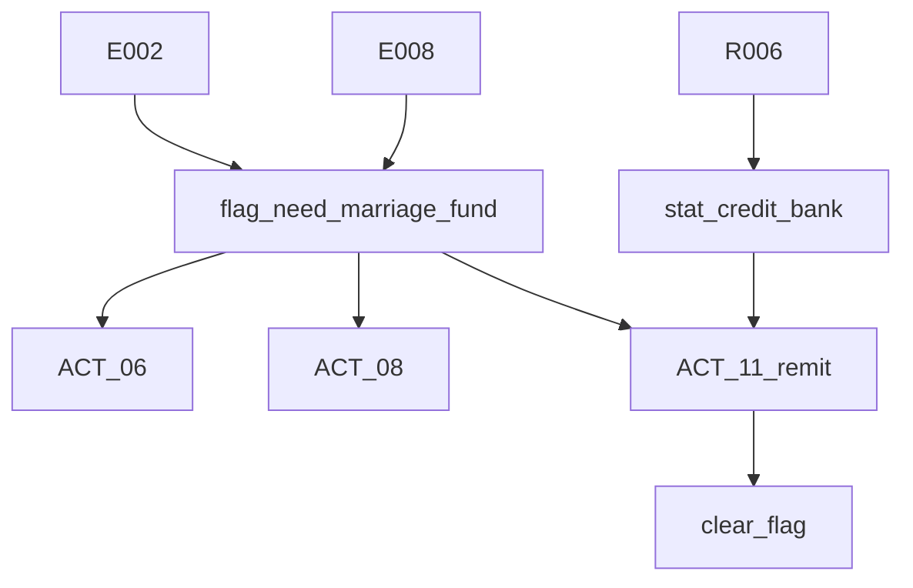

# 金融系统示例数据表（设计）

> 配合 [`金融系统.md`](金融系统.md) 阅读。  
> 目标不是定死实现，而是给 `def_finance_service` / `run_debt` / `run_org` / 关键事件 effect 一套可直接导表的样板。

---

## 1. `def_finance_service` 样例

### 1.1 票号短借

```yaml
service_id: svc_bank_loan_short
provider: org_bank
service_type: loan
loc_hint: loc_04
require:
  - { key: stat_money, op: ">=", value: 10 }
effects_on_open:
  - { op: add, key: stat_money, value: 15 }
  - { op: add, key: stat_suspicion, value: 3 }
  - { op: add, key: stat_credit_bank, value: 2 }
  - { op: set_flag, key: flag_bank_loan_active, value: true }
debt_template:
  principal: 15
  interest_per_day: 1
  due_in_days: 3
  collateral: none
risk:
  overdue_flag: flag_bank_loan_overdue
  on_overdue:
    - { op: add, key: stat_suspicion, value: 5 }
    - { op: add, key: stat_credit_bank, value: -10 }
```

### 1.2 票号展期

```yaml
service_id: svc_bank_rollover
provider: org_bank
service_type: rollover
loc_hint: loc_04
require:
  - { flag: flag_bank_loan_active, value: true }
effects_on_open:
  - { op: add, key: stat_money, value: -2 }
  - { op: add, key: stat_credit_bank, value: -5 }
debt_template:
  extend_days: 2
  extra_interest: 1
```

### 1.3 汇银回乡 / 办体面

```yaml
service_id: svc_bank_remit_home
provider: org_bank
service_type: remit
loc_hint: loc_04
require:
  - { key: stat_money, op: ">=", value: 20 }
effects_on_open:
  - { op: add, key: stat_money, value: -5 }
  - { op: add, key: stat_credit_bank, value: 3 }
  - { op: add, meter: impression_qing, value: 2 }
  - { op: clear_flag, key: flag_need_marriage_fund }
```

### 1.4 票号行情消息

```yaml
service_id: svc_bank_market_info
provider: org_bank
service_type: info
loc_hint: loc_04
require:
  - { key: stat_money, op: ">=", value: 10 }
effects_on_open:
  - { op: add, key: stat_money, value: -2 }
  - { op: add_range, key: stat_intel, min: 1, max: 3 }
  - { op: add, key: stat_credit_bank, value: 1 }
```

### 1.5 洋行代理佣金

```yaml
service_id: svc_foreign_commission
provider: org_baoshun
service_type: commission
loc_hint: loc_05
require:
  - { flag: flag_ending_c_ready, value: true }
effects_on_open:
  - { op: add, key: stat_credit_foreign, value: 20 }
  - { op: set_flag, key: flag_ending_c, value: true }
payout_rule:
  upfront_money: 20
  monthly_commission_band: high
  narrative_tags: [foreign, long_term, dirty]
```

---

## 2. `run_debt` 样例

### 2.1 票号短借实例

```yaml
run_debt:
  debt_bank_short_001:
    service_id: svc_bank_loan_short
    creditor: org_bank
    principal: 15
    remaining: 15
    interest_per_day: 1
    opened_day: 12
    due_day: 15
    collateral: none
    status: active
```

### 2.2 逾期后的状态

```yaml
run_debt:
  debt_bank_short_001:
    service_id: svc_bank_loan_short
    creditor: org_bank
    principal: 15
    remaining: 17
    interest_per_day: 1
    opened_day: 12
    due_day: 15
    collateral: none
    status: overdue
```

### 2.3 人情借账与债务的边界

```yaml
# 正规借贷：进 run_debt
run_debt:
  debt_bank_short_001: ...

# 人情欠账：进 run_edge
run_edge:
  char_wang_pangzi->char_lin_ruisheng:
    debt: 酒情未还
    leverage: 无
```

### 2.4 如烟线的情面资产样例

```yaml
# ACT_06 送点心后
run_edge:
  char_liu_ruyan->char_lin_ruisheng:
    debt: 收过你的小心意
    leverage: 无

# E008 后，钱家的礼继续压在如烟头上
run_edge:
  char_qian_zian->char_liu_ruyan:
    debt: 无
    leverage: 金镯与活路压力

# E012A 教她受礼传消息
run_edge:
  char_qian_zian->char_liu_ruyan:
    debt: 无
    leverage: 受礼把柄
  char_liu_ruyan->char_lin_ruisheng:
    debt: 替你担了脏风险
    leverage: 无

# E012B 坚决拒绝
run_edge:
  char_qian_zian->char_liu_ruyan:
    debt: 无
    leverage: 无
```

---

## 3. `run_org` 样例

### 3.1 钱记商行

```yaml
run_org:
  org_qianji:
    firm_bright: 55
    firm_dark: 40
    firm_heat: 25
    cash_bright: 60
    cash_dark: 45
    liquidity: 50
    payroll_pressure: 20
    tribute_pressure: 35
```

### 3.2 聚丰行

```yaml
run_org:
  org_jufeng:
    market_appetite: 60
    talent_budget: 40
    liquidity: 55
    poach_pressure: 35
```

### 3.3 宝顺洋行

```yaml
run_org:
  org_baoshun:
    foreign_margin: 65
    commission_budget: 50
    channel_hunger: 70
    compliance_mask: 60
```

---

## 4. 关键节点 effect 样例

### 4.1 `R006` 信用升级

```yaml
effects:
  - { op: set_flag, key: flag_bank_tier2, value: true }
  - { op: add, key: stat_credit_bank, value: 15 }
```

### 4.2 `E015C` 大量盗卖

```yaml
effects:
  - { op: add, key: stat_money, value: 100 }
  - { op: add, key: stat_intel, value: 10 }
  - { op: add, key: stat_suspicion, value: 40 }
  - { op: set_flag, key: flag_dirty_money_marked, value: true }
  - { op: add, edge: {from: char_qian_demao, to: char_lin_ruisheng}, key: leverage, value: 盗卖把柄 }
  - { op: unlock_clue, id: clue_opium_infer }
```

### 4.3 `E018A` 隐忍落账

```yaml
effects:
  - { op: add, key: stat_money, value: 5 }
  - { op: add, key: stat_trust_firm, value: 10 }
  - { op: set_flag, key: flag_ending_a, value: true }
```

### 4.3A `route_endure` 五层收益样板

```yaml
route_endure_reward_layers:
  layer_1_wage:
    narrative_gain: 月例更稳
    direct_effects:
      - { op: add, key: stat_money, value: 3 }
  layer_2_bonus:
    narrative_gain: 差事赏钱更常见
    direct_effects:
      - { op: add, key: stat_money, value: 2 }
  layer_3_expense_account:
    narrative_gain: 可先垫应酬账，事后报回
    soft_benefits:
      - 茶钱酒钱不必次次都从玩家私钱硬扣
      - 可作为后续社交行动的体面缓冲
  layer_4_ledger_access:
    narrative_gain: 开始经手后堂与跑街结算
    direct_effects:
      - { op: add, key: stat_trust_firm, value: 10 }
    soft_benefits:
      - 更容易接触账目异常与出入记录
  layer_5_dark_entry:
    narrative_gain: 被默许碰到暗线边缘
    soft_benefits:
      - 解锁黑钱真相与高风险高价值抉择
      - 退路更少，清洗风险更高
```

### 4.4 `E018B` 跳槽落账

```yaml
effects:
  - { op: set_flag, key: flag_rank_jufeng_paojie, value: true }
  - { op: add, key: stat_money, value: 10 }
  - { op: add, key: stat_credit_market, value: 15 }
  - { op: set_flag, key: flag_ending_b, value: true }
```

### 4.5 `E018C` 洋行落账

```yaml
effects:
  - { op: set_flag, key: flag_rank_foreign_agent, value: true }
  - { op: add, key: stat_money, value: 20 }
  - { op: add, key: stat_credit_foreign, value: 20 }
  - { op: set_flag, key: flag_ending_c, value: true }
```

---

## 5. 建议用法

1. 先把 `def_finance_service` 当作设计层模板，不急着在所有事件里铺满。  
2. Demo 先优先接 `svc_bank_loan_short`、`svc_bank_rollover`、`svc_bank_remit_home`。  
3. `E015C` 与 `E018A/B/C` 先用 effect 样例统一口径，再决定是否真的写回主档案。  
4. 人情债继续优先放 `run_edge.debt`，避免 `run_debt` 泛滥。  

---

## 6. 婚事资金链样例



口径：

- `E002` / `E008` 负责**抬压力**
- `ACT_06` / `ACT_08` 负责**表现压力**
- `R006` 负责**票号信用升级**
- `ACT_11.remit` 负责**第一次把婚事压力转成可处理的正规金融行为**
